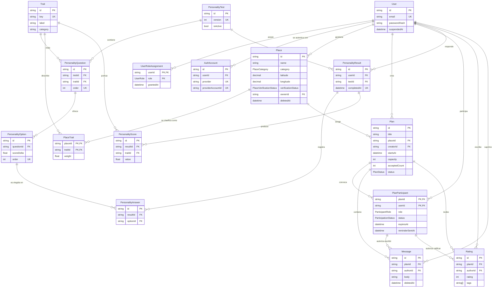
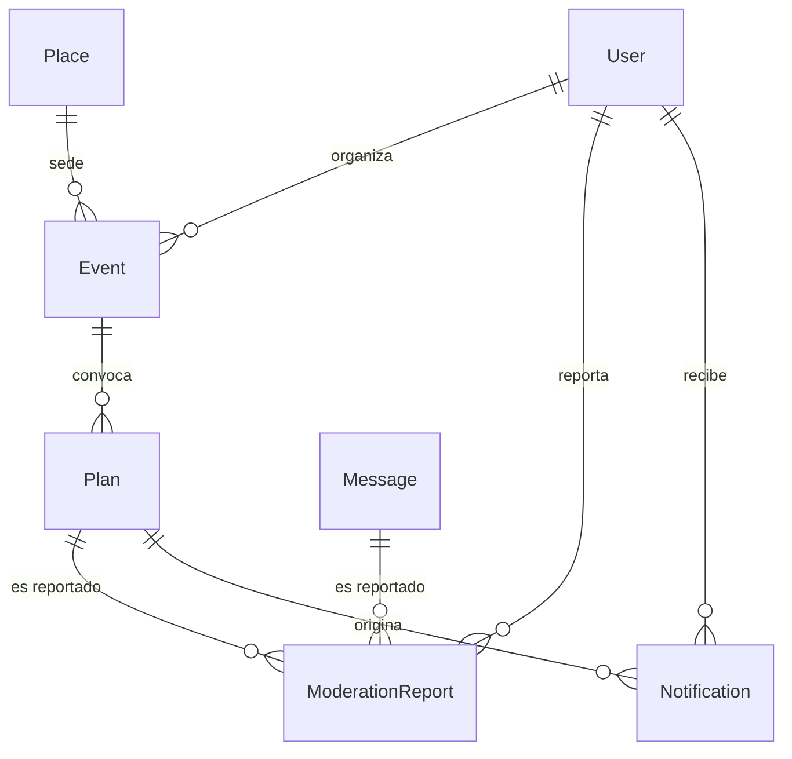

# Nexa — Modelo de datos (vertical slice)

Estado: **propuesto, pendiente de validación.**
Artefactos: `prisma/schema.prisma` · este documento.

Alcance: el vertical slice acordado
`Registro → test de personalidad → explorar mapa → crear plan → unirse → chat dentro del plan → calificar`

Host, Pago, Evento y moderación avanzada quedan **fuera de alcance** pero ya son referenciables (ver §6).

---

## 1. Glosario: tus nombres → nombres del esquema

Usé identificadores en inglés (convención Prisma, sin acentos ni `ñ`, y coincide con la documentación del framework). La UI y los docs quedan en español.

| Tu nombre | Modelo | Qué se añadió aparte |
|---|---|---|
| Usuario | `User` | `UserRoleAssignment` (roles), `AuthAccount` (Google/Apple) |
| PersonalidadTest | `PersonalityTest` | `PersonalityQuestion`, `PersonalityOption`, `PersonalityResult`, `PersonalityAnswer`, `PersonalityScore` |
| Lugar | `Place` | `PlaceTrait` (ambientes) |
| Plan | `Plan` | — |
| PlanParticipante | `PlanParticipant` | — |
| Mensaje | `Message` | — |
| Calificación | `Rating` | — |
| — | `Trait` | **tabla nueva**: vocabulario compartido usuario↔lugar |

**16 tablas.** `Trait` es la única que no estaba en tu lista y es la que hace posible el "alineado con tu personalidad" sin IA. Ver §5.1.

---

## 2. Diagrama de entidades



### Entidades diferidas (fuera del slice, mostradas aparte)



Estas **no existen todavía**. Cuando se creen, solo referenciarán tablas de la izquierda, que ya están estables. Ver §6.

---

## 3. Reglas de negocio → mecanismo de garantía

Esta es la tabla que importa. Cada regla del `.docx` y el mecanismo que la vuelve imposible de violar.

| Regla del spec | Mecanismo en el esquema |
|---|---|
| **"Nexa no conecta personas directamente"** (§0) | No existe tabla de conversaciones ni columna `recipientId`. No hay forma de modelar un chat 1:1. |
| **"Chat solo dentro de planes"** (§2.5) | `Message.planId` es NOT NULL, **y** `Message` tiene FK compuesta `(planId, authorId) → PlanParticipant(planId, userId)`. No se puede insertar un mensaje sin plan, ni por alguien que no participa. Doble barrera, en la base de datos. |
| **"Sin mensajes en frío"** (§2.5) | Consecuencia directa: no existe ruta de modelo para escribirle a un usuario. El único canal de escritura es `Message`, y exige una participación previa. |
| **Nexa es gratis, sin tiers ni pagos** (§1.1) | No existe `User.planTier`, ni `premiumUntil`, ni tablas `Payment`/`Subscription`. No hay superficie de cobro en el esquema, y no hay nada que apagar si el negocio cambia de opinión: se agrega en su momento. |
| **Solo lugares verificados visibles** (§13.5) | `Place.verificationStatus` (PENDING/APPROVED/REJECTED) + `verifiedById`/`verifiedAt` para auditoría. Índice compuesto para que el filtro sea el camino por defecto del planner. |
| **Unirse requiere aprobación** (§2.4) | `PlanParticipant.status` nace en `REQUESTED`; solo el `ORGANIZER` transiciona a `ACCEPTED`. Ver §5.8 para la auto-resolución por timeout. |
| **Cancelar no borra historial** (§2.4) | Cancelación es `status = CANCELLED`, no `DELETE`. Preserva la confianza y permite `NO_SHOW`. |
| **Un plan, un lugar** (§2.3/2.4) | `Plan.placeId` NOT NULL + `onDelete: Restrict`. El contexto físico es obligatorio: es la premisa del producto. |
| **Grupos pequeños** | `Plan.capacity` NOT NULL. `FULL` **no se almacena**: se deriva de contar `ACCEPTED` vs `capacity`. |
| **Se califica la experiencia, no la persona** (§10) | `Rating` cuelga de `Plan`, y `Plan` cuelga de `Place`. No existe "calificar a un usuario" en el modelo. Alineado con §3: nada mide habilidad social. |
| **Una calificación por persona por plan** | `@@unique([planId, authorId])`. |
| **Solo participantes califican** | FK compuesta a `PlanParticipant` (mismo mecanismo que `Message`). |
| **Multi-rol (Nexa User que también es Host)** (§13) | `UserRoleAssignment` con PK `(userId, role)`, no un enum en `User`. El modelo anónimo "Rappi" del spec lo exige. |
| **El lugar sobrevive a la baja del Host** | `Place.ownerId` nullable + `onDelete: SetNull`. Un plan antiguo sigue resolviendo el nombre de su lugar. |
| **Moderación sin destruir evidencia** (§13.4) | `User.suspendedAt`/`suspendedReason`; `Message.deletedAt`/`deletedById` (borrado lógico con autor de la supresión). |
| **Test versionado y re-puntuable** (§2.2) | `PersonalityTest.version` unique + `PersonalityResult` unique por `(userId, testId)`. Las respuestas crudas (`PersonalityAnswer`) sobreviven a los cambios de algoritmo, y `PersonalityScore` se puede recalcular. |
| **"Experiencias alineadas a la personalidad"** (§0, §5 IA) | `Trait` es vocabulario compartido: `PersonalityScore` (el usuario) y `PlaceTrait.weight` (el lugar) viven en los mismos ejes. El match es un producto escalar en SQL. **No necesita IA para funcionar.** |
| **Confianza entre usuarios** (§4) | **Score de comportamiento derivado**, nunca un juicio escrito por humanos. Se calcula con un CTE sobre `PlanParticipant.status` (`ATTENDED` a favor, `NO_SHOW` en contra, `CANCELLED` neutro, suavizado de Laplace con α=2). Sin tabla. Ver §5.9. |

---

## 4. Enumeraciones

| Enum | Valores | Nota |
|---|---|---|
| `UserRole` | USER, HOST, MODERATOR, CURATOR, ADMIN | Auto-registro: USER y HOST. Los otros tres son de equipo, se otorgan. |
| `PlaceCategory` | CAFE, RESTAURANT, MUSEUM, PARK, WORKSHOP, SPORTS, BAR, LIBRARY, OTHER | Filtros del módulo de exploración. |
| `PlaceVerificationStatus` | PENDING, APPROVED, REJECTED | Curaduría (§13.5). |
| `PlanStatus` | OPEN, CANCELLED, COMPLETED | `FULL` se deriva, no se guarda. |
| `ParticipantRole` | ORGANIZER, PARTICIPANT | El organizador aprueba y descarta. |
| `ParticipationStatus` | REQUESTED, ACCEPTED, DECLINED, CANCELLED, ATTENDED, NO_SHOW | Máquina de estados; transiciones en la capa de servicio. |

---

## 5. Decisiones de diseño y sus trade-offs

### 5.1 `Trait` como vocabulario compartido (añadido)

La propuesta obvia era puntuar al usuario con un test y clasificar el lugar con etiquetas propias. Eso no permite comparar nada: "el usuario es 0.7 introvertido" y "el lugar es un bar ruidoso" viven en espacios distintos.

Aquí **el test y la curaduría usan los mismos ejes**. El recommendation de v1 es SQL puro:

```sql
SELECT p.*, SUM(ps.value * pt.weight) AS alignment
FROM Place p
JOIN PlaceTrait pt     ON pt.placeId = p.id
JOIN PersonalityScore ps ON ps.traitId = pt.traitId
JOIN PersonalityResult r  ON r.id = ps.resultId AND r.userId = $1
WHERE p.verificationStatus = 'APPROVED' AND p.deletedAt IS NULL
GROUP BY p.id
ORDER BY alignment DESC;
```

Cuando la IA entre (§5 del spec), se suma ranking semántico **encima** de esta base. El modelo no cambia.

### 5.2 Sin tiers: el producto es gratis

El spec pedía freemium/premium y el slice lo implementó con `User.planTier` + `User.premiumUntil`. **Se eliminaron los dos** junto con el enum `PlanTier`: no hay cobro, ni prueba, ni periodo de gracia, ni nada que los justifique. Un `premiumUntil` que nadie puede leer en la app es un campo que solo se desincroniza. Si el negocio cambia de opinión, el pago entra después, con su propio diseño (tabla `Payment`, no una columna más), y no como un parche sobre un enum que nunca se usó.

La lección que sí queda: cuando un modelo tiene un campo que ninguna pantalla lee, el costo no es el campo. Es que la base declara un contrato que la app no cumple.

### 5.3 Roles en tabla aparte, no enum en `User`

El spec dice explícitamente "similar a Rappi o Uber": una persona puede ser usuario y host a la vez. Un `enum role` en `User` obliga a elegir uno. Además permite revocar el rol MODERATOR sin tocar la fila del usuario, y `grantedById` deja rastro de quién lo concedió.

### 5.4 `User` única para los 5 roles

No hay tabla `Host`. **Un host es un `User` con `UserRoleAssignment(role = HOST)`.** Ver §6.

### 5.5 Geolocalización sin PostGIS (de momento)

`latitude`/`longitude` como `Decimal(9,6)` con índice compuesto. Búsqueda de cercanía: bounding box en SQL + Haversine para el refinado. Alcanza para decenas de miles de lugares.

Ruta de actualización: `Unsupported("geography(Point, 4326)")` + índice GiST, leído y escrito con `$queryRaw`. Requiere que `create`/`update` de `Place` hagan upsert en dos pasos. Déjalo para cuando la búsqueda por distancia sea el cuello de botella real.

### 5.6 `PersonalityAnswer` y `PersonalityScore` conviven

`Answer` es la verdad (lo que eligió la persona). `Score` es **derivado y sobrescribible**: recalcular con un algoritmo nuevo no pierde nada y permite comparar "cómo puntuaba v1 vs v2". `PersonalityScore` se puede vaciar y regenerar en cualquier momento.

### 5.7 Sin `EventId` ni `PagoId` colgando de `Plan`

No agregué columnas apuntando a tablas que no existen. Ver §6 para por qué eso es lo correcto.

### 5.8 Ciclo de vida de una solicitud (`expiresAt`)

Regla acordada: unirse a un plan **requiere aprobación del organizador**, pero la solicitud **se auto-resuelve** para que ni el organizador ni quien se une queden colgados.

**Cálculo del plazo.** Al insertar la solicitud:

```
expiresAt = min(now() + 24h, plan.startsAt)
```

Si el plan empieza en 2 horas, el plazo es de 2 horas. Si empieza en 3 días, son 24 horas. En ambos casos el plazo nunca sobrevive al inicio del plan. `expiresAt` es **nullable**: solo tiene sentido mientras `status = REQUESTED`; en REQUESTED se escribe siempre, y se conserva después como evidencia.

**Job de auto-resolución.** Corre periódicamente y resuelve lo que venció:

```sql
SELECT planId, userId FROM PlanParticipant
WHERE status = 'REQUESTED' AND expiresAt <= now()
ORDER BY expiresAt;
```

- Si hay cupo → `ACCEPTED`
- Si el plan ya está lleno → `DECLINED`
- En ambos casos escribe `respondedAt = now()`

Índice que lo sirve: `PlanParticipant(status, expiresAt)`. El `status` va primero porque siempre se filtra por `status = 'REQUESTED'`; `expiresAt` solo se compara dentro de ese conjunto.

**Recordatorio a mitad de plazo.** Se dispara en el punto medio entre `joinedAt` y `expiresAt`, y escribe `reminderSentAt` para ser idempotente. Sin esa columna, un reintento del job reenvía el recordatorio al organizador cada ciclo.

**Notificación al organizador.** Push inmediato en el `INSERT` de la solicitud.

`reminderSentAt` no es decorativo: sin ella el recordatorio no es idempotente, y los jobs se reintentan.

**`respondedAt` ahora tiene dos autores:** el organizador (respuesta manual) y el job (auto-resolución). Si más adelante querés distinguir "lo aceptó una persona" de "lo aceptó el timeout", el disparador de `DECLINED` lo dice (`respondedAt` es null), pero para `ACCEPTED` haría falta un campo extra. De momento no lo agregué porque no hay caso de uso de negocio que lo pida.

### 5.9 §4 "Sistema de Confianza Nexa": por qué `Rating` no lleva `ratedUserId`

**Decisión: `Rating` califica la experiencia, nunca a la persona. Sin `ratedUserId`.**

Razones, de la más fuerte a la más débil:

**1. El `.docx` no especifica ninguna funcionalidad para §4.** Es la única sección de "sistemas" sin línea de `Funcionalidades:`. No hay requisito del cual derivar una columna. Construirla sería inventar un requisito.

**2. Meter los dos juicios en una fila los acopla para siempre.** `Rating` ya tiene su identidad estructural: la FK compuesta `(planId, authorId) → PlanParticipant`. Un `ratedUserId` necesitaría **su propia FK a esa misma fila de participación**, y la fila acabaría respondiendo "¿qué tal el plan?" y "¿qué tal la persona?" a la vez. Consecuencias:

- No podés mostrar la reputación de un lugar sin filtrar los juicios sobre personas.
- No podés moderar un reporte de acoso (sobre la persona) sin tocar la calificación del plan.
- El derecho de supresión de una persona (RGPD) te obliga a recorrer calificaciones que no son sobre ella.

Son dos señales distintas, con consumidores distintos y ciclos de vida distintos.

**3. El riesgo de producto es específico y alto.** La audiencia de Nexa tiene ansiedad social por definición (§0). Una calificación pública y permanente entre personas **reproduce exactamente el juicio social que el producto existe para eliminar**: es el disparador, no la cura. Y contradice de frente el principio fundacional: "Nexa no conecta personas directamente". Una calificación de persona **es** una conexión directa, cuantificada y permanente.

Además, calificar a alguien que viste una vez en un plan de 4 es estadísticamente vacío (n=1) y socialmente cruel. El dato no es confiable.

**4. La confianza real ya está en el esquema, y es derivada, no escrita por humanos.** `PlanParticipant.status` tiene los tres campos que importan. La confianza no la escribe un usuario: se calcula de la conducta.

```sql
SELECT
  COUNT(*) FILTER (WHERE status = 'ATTENDED')  AS asistio,
  COUNT(*) FILTER (WHERE status = 'NO_SHOW')   AS no_show,
  COUNT(*) FILTER (WHERE status = 'CANCELLED') AS cancelo
FROM "PlanParticipant"
WHERE userId = $1;
```

**Qué falta hoy, y sí conviene arreglar (sin tabla nueva):** el organizador **no ve esa información al aprobar una solicitud**. Aprueba mirando solo el perfil de personalidad. Para alguien con ansiedad social, aprobar a ciegas es justo la situación que el producto promete evitar: "evita interacciones forzadas" y "exposición innecesaria" son literalmente las funciones del sistema.

**Arreglo en el slice, cero cambios de esquema:** la pantalla de solicitudes del organizador muestra esa query como historial de reliability, junto a la alineación de personalidad. Se implementa en el paso A.

**Definición del score (§4 confirmado: score de comportamiento, derivado, nunca escrito por humanos).**

Los datos ya están en `PlanParticipant.status`. Falta decidir la fórmula, y acá hay dos detalles que el producto obliga a elegir de una forma específica:

**1. `CANCELLED` no cuenta en contra.** Es contraintuitivo, pero es la decisión correcta para esta audiencia. El spec ofrece "Cancelar" como funcionalidad (§2.4) y §0 promete evitar "exposición innecesaria". Alguien con ansiedad que cancela la noche antes está **comportándose bien**, no mal. Penalizar eso empuja a no cancelar nunca, que es exactamente el comportamiento dañino que hay que evitar. En cambio `NO_SHOW` sí cuenta en contra: dijo que iba y no fue, y eso afecta al grupo que lo esperaba.

**2. Cold start neutro, nunca 0.** Con suavizado de Laplace, un usuario sin historial da exactamente 0.5, y un usuario con pocos datos nunca llega a 1.0:

**La fórmula es correcta; la query no lo era.** Tenía dos defectos, y el segundo es más grave que la aritmética.

```sql
-- DEFECTUOSA: el usuario sin participaciones NO APARECE en el resultado.
WITH conduct AS (
  SELECT
    userId,
    COUNT(*) FILTER (WHERE status = 'ATTENDED')::float AS asistio,
    COUNT(*) FILTER (WHERE status IN ('ACCEPTED', 'ATTENDED', 'NO_SHOW'))::float AS n
  FROM "PlanParticipant"
  GROUP BY userId
)
SELECT userId, (asistio + 2.0 * 0.5) / (n + 2.0) AS reliability
FROM conduct;
```

**Defecto 1 — aritmético.** Los números de ejemplo estaban mal. La fórmula en sí estaba bien.

**Defecto 2 — grave, e invisible al hacer cuentas a mano.** `GROUP BY` sobre un conjunto vacío no genera ningún grupo, así que **un usuario sin ninguna participación no devuelve fila**: no da 0.5, no da 0, no da nada. En la prueba la query devolvió 7 filas para 8 usuarios, y el ausente fue precisamente el usuario nuevo — el que todo el argumento de cold start existe para proteger. El caso "n=0 → 0.5" que parece coincidir es **inalcanzable** en esa query: `n=0` solo le existe a quien ya tiene filas excluidas del denominador.

La forma correcta arranca desde `User`:

```sql
WITH conduct AS (
  SELECT
    userId,
    COUNT(*) FILTER (WHERE status = 'ATTENDED')::float AS asistio,
    COUNT(*) FILTER (WHERE status IN ('ACCEPTED', 'ATTENDED', 'NO_SHOW'))::float AS n
  FROM "PlanParticipant"
  GROUP BY userId
)
SELECT
  u.id,
  COALESCE((c.asistio + 2.0 * 0.5) / (c.n + 2.0), 0.5) AS reliability
FROM "User" u
LEFT JOIN conduct c ON c.userId = u.id;
```

**Por qué las dos piezas son necesarias, y no es por el valor.** Esto es lo counterintuitive y vale la pena dejarlo escrito:

- El `LEFT JOIN` no está ahí para cambiar el número. Está para que el usuario **exista en el conjunto de resultados**. Sin él, el usuario nuevo simplemente no está, y una lista de solicitudes ordenada por reliability lo deja fuera de la lista — invisible, sin error, sin log.
- El `COALESCE` no está ahí para pasar el `NULL` a 0.5 por robustez. Está porque **sin él el `NULL` se ordena primero**: en PostgreSQL el default de `ORDER BY ... DESC` es `NULLS FIRST`. Verificado: el usuario nuevo con `LEFT JOIN` pero sin `COALESCE` sale **de primero** en la lista, por encima del usuario con 10 asistencias y 0.917. Eso es peor que la ausencia, porque parece una decisión del sistema y en realidad es un bug de ordenamiento.

**Y una corrección sobre mí mismo:** escribí que poner el `COALESCE` *adentro* de la división daba un valor degenerado. **Falso, y lo verifiqué.** `(COALESCE(asistio,0) + 1.0) / (COALESCE(n,0) + 2.0)` también da exactamente 0.5, porque la prior `(n + 2.0)` ya está definida en `n = 0`. El `COALESCE` alrededor es por el **ordenamiento**, no por la aritmética. La fórmula es correcta en `n = 0` por construcción; lo único que hay que proteger es que el usuario llegue a existir como fila.

**Valores verificados ejecutando esa query en PostgreSQL 17.11**, no calculados a mano:

| Caso | `asistio` / `n` | reliability | Lo que decía este doc antes |
|---|---|---|---|
| Sin participaciones | — / — | **0.500** | 0.5 ✅ |
| Solo 3 cancelaciones | 0 / 0 | **0.500** | — |
| 1 de 1 | 1 / 1 | **0.667** | 0.75 ❌ |
| 4 asistencias + 1 no-show | 4 / 5 | **0.714** | — |
| 10 de 10 | 10 / 10 | **0.917** | 0.83 ❌ |
| 10 asistencias + 2 cancelaciones | 10 / 10 | **0.917** | — |
| 10 asistencias + 1 no-show | 10 / 11 | **0.846** | — |
| 0 asistencias + 6 no-shows | 0 / 6 | **0.125** | — |

**La semántica quedó confirmada, que era lo que había que probar:**

- `CANCELLED` es **neutro de verdad**: 10 asistencias con 2 cancelaciones da **0.917, idéntico** a 10 asistencias sin cancelaciones. No toca ni numerador ni denominador.
- `NO_SHOW` **sí penaliza**: 0.917 → 0.846.
- El piso real con 6 no-shows consecutivos es 0.125, y la serie se acerca a 0 sin tocarlo.
- El techo se acerca a 1 sin tocarlo: **hacen falta 8 planes perfectos para llegar a 0.90**.

**Dos propiedades de la curva que hay que conocer antes de usarla.** El score está mucho más comprimido de lo que sugerían los números erroneous, y eso tiene dos consecuencias operativas:

1. **Sirve para ordenar, no para filtrar.** Casi todos los usuarios con menos de 10 planes se agrupan cerca de 0.5. Úsalo como criterio de orden en la lista de solicitudes, nunca como umbral de admisión. Si se usa como puerta ("solo entra quien tiene 0.8"), se está meditando la curva entera y no la conducta real.
2. **La varianza es alta cuando `n` es bajo.** Con α=2, un no-show a `n=3` mueve el score de 0.800 a 0.500 — un salto de 0.3. A `n=11` el mismo no-show lo mueve 0.007. Es inherente al suavizado: con pocos datos, el score confía casi por completo en ellos. Es el comportamiento correcto estadísticamente, pero implica que **los primeros planes de cada usuario pesan mucho más que los últimos**. No lo trates como una curva de aprendizaje estable.

**Por qué el cold start tiene que ser 0.5 y no 0:** la estrategia de adquisición del propio §1 es "reducir la barrera de entrada". Un usuario nuevo con reliability 0 quedaría ordenado último en todas partes, haciéndolos invisible justo a la población que Nexa existe para servir — las personas con ansiedad social son las menos probables de tener planes anteriores. Confiar en usuarios nuevos los hundiría. La fórmula lo resuelve sin ningún umbral mágico.

**Por qué suavizado y no un `CASE` con "mínimo 3 planes":** el `CASE` tiene un salto brusco en el tercer plan y dos constantes mágicas que alguien va a cuestionar en seis meses. La fórmula es continua, tiene un parámetro solo, y da el comportamiento correcto en todos los casos límite sin ningún caso especial.

**Consumidores del score — el score está resuelto, el consumidor no:**

- **Ordenar las solicitudes pendientes del organizador.** Claro, es un slice need: el organizador ordena primero a quien más probablemente va en serio. Es un uso interno, no expuesto como número al usuario.
- **Pesar las recomendaciones de planes.** Requiere una decisión que todavía no está tomada: ¿`reliability(plan.creator)`, o también la del resto de participantes? Afecta si un plan con un no-show habitual se sigue recomendando. **Es lo único de §4 que queda abierto.**

**Por qué sigue sin tabla en el esquema:** con el volumen del slice, esta consulta es un CTE en la query de ranking, no una tabla precalculada. Una tabla materializada necesita ventana temporal, cadencia de refresco y una reconciliación de deriva — tres parámetros que nadie especificó. **Disparador para materializar:** cuando la query de ranking supere ~200 ms medidos sobre datos reales. No antes.

**Ruta de alta: `UserTrustSignal`.** Cuando haga falta materializar, es un agregado derivado con clave de referencia hacia adelante:

```
UserTrustSignal(userId, window, attended, noShow, updatedAt)
```

y con la disciplina de §6 no toca ninguna tabla existente.

### 5.10 `Notification`: por qué no está modelada todavía

La regla acordada en §5.8 pide tres notificaciones (solicitud, recordatorio, y las de aceptación/rechazo). Eso necesita persistencia: un recordatorio agendado a 12 horas tiene que sobrevivir a un reinicio, y no se puede garantizar eso tirando un evento a Redis sin rastro.

No la modelé igual porque **su forma depende de dos decisiones que todavía no están tomadas**, y adivinar mal la cuesta caro:

1. **Canal y proveedor**: web push (VAPID), FCM, APNs, o email. Determina si hacen falta columnas de destino, y si el envío es síncrono o encolado.
2. **Estado de entrega**: si alcanza con "creado / leído" o hace falta `sentAt`, `deliveredAt`, `failedAt` y reintentos. Eso decide si `Notification` es una bandeja del usuario o un log de deliveries.

Lo que sí quedó preparado: `PlanParticipant` tiene los ganchos (`expiresAt`, `reminderSentAt`), y `Notification` apuntaría a `User` y `Plan` sin necesitar una sola columna nullable nueva. Cuando se defina el canal, es una tabla nueva y ya.

---

## 6. Entidades diferidas: por qué no hay que rehacer nada

Regla: **una entidad diferida apunta hacia afuera, a tablas ya estables. Nunca al revés.** Así, crearla es 100% aditivo.

| Entidad futura | Referencia a tablas existentes | Qué hay que agregar a las tablas de hoy |
|---|---|---|
| `Event` | `→ Place`, `→ User` (organizer) | Solo nullable: `Plan.eventId`. Permite que un plan sea espontáneo o una sesión de un evento curado. |
| `Notification` | `→ User`, `→ Plan` | Nada. Requiere la decisión de §5.10. |
| `UserTrustSignal` | `→ User` | Nada. Agregado derivado de `PlanParticipant.status`. Se materializa solo si el ranking pasa ~200 ms (§5.9). |

**El pago no está diferido, está cancelado.** `Payment` y `Subscription` no son trabajo pendiente: el producto es gratis y no hay cobro que diseñar todavía. Cuando exista, se diseña entero (y casi seguro no con las columnas que el slice llegó a tener). `User.stripeCustomerId` ya no existe precisamente para que esa tabla llegue cuando haya algo real que guardarle.

**`Host` no necesita ninguna tabla.** `Place.ownerId` ya apunta a `User`, y el rol sale de `UserRoleAssignment`. Cuando llegue el módulo de Host, lo que se agrega es *funcionalidad* (publicar eventos, métricas, cobros), no estructura.

Costo de añadir las tres después: una migración con columnas nullable y tablas nuevas. **Cero cambios en el esquema de hoy.**

---

## 7. Índices y las consultas que sirven

| Consulta caliente | Índice que la sirve |
|---|---|
| "Lugares cerca de mí, verificados, categoría X" | `Place(verificationStatus, category)` + `Place(latitude, longitude)` para el bounding box |
| "Mis planes" (pantalla más frecuente del producto) | `PlanParticipant(userId, status)`. La PK `(planId, userId)` solo sirve el lado plan. |
| "Quiénes van a este plan" | PK de `PlanParticipant` |
| "Mensajes del plan en orden" | `Message(planId, createdAt)` |
| "Lugares que matchean mi perfil" | `PlaceTrait(traitId)` + `PersonalityScore(traitId)` |
| "Reputación de este lugar" | `Rating(planId)` → `Plan.placeId`. **Diferido a propósito:** el promedio por plan ya se muestra en el detalle, pero el agregado a través de los planes necesita decidir la ponderación entre un plan de 2 y uno de 20 personas. Ver §16.9 de `docs/decisiones-auth.md`. |
| "Historial de reliability para aprobar una solicitud" (§5.9) | `PlanParticipant(userId, status)` ya lo cubre. **Sin índices ni tablas nuevas.** |
| "Panel de moderación: cuentas suspendidas" | `User(planTier)` no sirve; agregar índice parcial `WHERE suspendedAt IS NOT NULL` cuando exista esa pantalla |

`Place` NO tiene `deletedAt` en ningún índice compuesto a propósito: el filtro va en el `WHERE`, y el índice debe seguir siendo usable. Si el volumen lo justifica, un índice parcial `WHERE deletedAt IS NULL AND verificationStatus = 'APPROVED'`.

El índice de "Mensajes del plan en orden" es `(planId, createdAt)`, y el cursor del chat pagina con `(createdAt, id)`. **El `id` no está en el índice** y no hace falta: desempata una condición que solo se da cuando dos mensajes caen en el mismo milisegundo, y PostgreSQL puede recorrer ese empate desde el índice para después ordenar las pocas filas empatadas. Agregar `id` al índice solo se justifica si aparece un caso real de empates masivos (un import, por ejemplo), y antes de tocarlo hay que mirar el `EXPLAIN` de la consulta paginada.

---

## 8. Límites: qué NO garantiza el esquema

Honestidad importante. Estas reglas las valida la capa de servicio, no la base de datos:

1. **La FK de `Message`/`Rating` prueba pertenencia, no estado.** Un participante con `status = CANCELLED` todavía puede insertar mensajes: la FK se cumple igual. El API debe filtrar por estado.
   **Resuelto para el chat:** `GET`/`POST /api/plans/[planId]/messages` exige un estado de `CHAT_ABIERTOS_A` (`ACCEPTED`, `ATTENDED`, `NO_SHOW` — el chat **no** se cierra cuando el plan termina) y sale con 403 en `REQUESTED`, `DECLINED` y `CANCELLED`. Hay un test que inserta el mensaje por la base con `CANCELLED` y comprueba que la API lo rechaza.
   **Resuelto también para `Rating`:** `POST /api/plans/[planId]/ratings` exige `ATTENDED` **y** que el plan haya terminado, y sale con 403 en los otros casos. El gate es **distinto** al del chat a propósito: el chat es un canal y abrirlo a un `NO_SHOW` es correcto, pero calificar es un juicio con peso reputacional y `NO_SHOW` no puede hacerlo. Un `ACCEPTED` tampoco: todavía no tiene una experiencia terminada que juzgar. La FK sigue sin garantía de estado — lo que la cubre es la capa de servicio, y ahora hay tests de los dos lados.
2. **`ATTENDED` y `NO_SHOW` no tenían productor, y eso invalidaba tres lectores.** El enum los tenía desde el diseño (§4) y la reliability de §5.9, el gate del chat (§15.1 de `docs/decisiones-auth.md`) y la ventana de calificación los leían, pero **nada en el proyecto los escribía**. La reliability devolvía "Sin historial" para siempre y los tests lo pasaban igual, porque sembraban los estados a mano por SQL crudo. El productor es `POST /api/plans/[planId]/attendance`, que escribe la fila de `PlanParticipant`. Reglas: solo el organizador, solo desde `ACCEPTED`/`ATTENDED`/`NO_SHOW`, nunca vuelve a `ACCEPTED`, y **no toca `acceptedCount`** (marcar asistencia no libera ni ocupa lugar; tocar el contador acá daría dos fuentes de verdad para el cupo, que hoy sostiene entero el endpoint de solicitudes). El esquema no garantiza nada de esto: es capa de servicio, y ahora con tests.
3. **La ventana de calificación no se apoya en `Plan.status = 'COMPLETED'`, porque nadie lo escribe.** Igual que los dos estados anteriores, `COMPLETED` existe en el enum y no tiene productor. La regla se deriva de la hora: `endsAt ?? startsAt <= ahora`, más `status != 'CANCELLED'`. Vive en `lib/plan-finished.ts` y la comparten el endpoint, la pantalla y la validación. Cuando exista el job que marque `COMPLETED`, la regla se apoya en el estado **además** de la hora, nunca en vez de la hora.
4. **No hay garantía de `capacity`, y el job de §5.8 la hace explícitamente explotable.** Este es el riesgo #1 del diseño: el job resuelve **en lote** todas las solicitudes vencidas, y si acepta a ciegas, un plan de 4 personas con 15 solicitudes vencidas termina con 15 aceptados. Un plan sobrecapacidadado destruye la promesa del producto entera.

   El job debe transicionar **una solicitud a la vez**, con la fila del `Plan` bloqueada:

   ```sql
   BEGIN;
   SELECT capacity, accepted_count FROM Plan WHERE id = $1 FOR UPDATE;
   -- si accepted_count < capacity → ACCEPTED, accepted_count = accepted_count + 1
   -- si no                      → DECLINED
   COMMIT;
   ```

   Por eso el contador desnormalizado `Plan.acceptedCount` deja de ser una optimización y pasa a ser **necesario**: hace el check del cupo en O(1) dentro de la transacción en lugar de contar filas. Ya está en el esquema por eso, aunque el slice todavía no lo use.

   El invariante es `acceptedCount = COUNT(participantes con status IN (ACCEPTED, ATTENDED))`, y hay que mantenerlo **incrementalmente en cada transición de estado**: `+1` al aceptar, `−1` al cancelar. El riesgo clásico de los contadores desnormalizados es la deriva. Auditálo:

   ```sql
   SELECT p.id, p.accepted_count, COUNT(pp.userId) AS real
   FROM Plan p JOIN PlanParticipant pp ON pp.planId = p.id
     AND pp.status IN ('ACCEPTED','ATTENDED')
   GROUP BY p.id, p.accepted_count
   HAVING p.accepted_count <> COUNT(pp.userId);
   ```

   Esa query debería devolver 0 filas siempre. Si devuelve algo, hay un bug de aceptaciones/cancelaciones. Correla como check periódico; es más barato que un `COUNT` en cada join al plan.
5. **El organizador debe ser participante.** No hay constraint que lo impida; se fuerza al crear el plan (inserta al creador como `ORGANIZER` + `ACCEPTED` en la misma transacción).
6. **No hay gating por pago.** No existe `planTier` ni `premiumUntil`: todas las pantallas se abren igual para cualquiera con sesión. Cuando exista un cobro, el gate va en la capa de servicio, no en una columna que el cliente pueda leer.
7. **Email sin normalizar.** `email` es `unique` pero "Stiven@x.com" y "stiven@x.com" son distintos. Normalizar a minúsculas en la capa de servicio, o con un índice funcional `LOWER(email)` en migración.
8. **El `ON` de `Place.verificationStatus` no es un default por defecto.** Nadie ve un lugar hasta aprobarlo, pero eso es una condición del query de exploración, no una restricción.
9. **La lista de quién estuvo y la de quién califica se filtran en la capa de servicio, y el filtro depende de quién mira.** `GET /api/plans/[planId]` devuelve `count` y `average` de las calificaciones a cualquiera que vea el plan, el conteo agregado de etiquetas (`tags`) también, el voto propio a quien lo pueda hacer, y la lista con nombres y etiquetas **solo al organizador**: `detail` es `null` para los demás. Lo mismo con los participantes: el `NO_SHOW` **desaparece de la lista entera** para quien no organiza, no solo con el `status` en `null`. Esto no se puede expresar como un `where` fijo de la query, porque depende de si el viewer es el creador y eso se sabe recién con el resultado de la misma consulta. Ver §16.6, §16.7 y §16.10 de `docs/decisiones-auth.md`.
10. **`Rating.tags` es un array de ocho valores cerrados, no texto libre.** No hay `Rating.comment`: se eliminó a propósito, porque era el único texto libre con nombre de persona en la base y sus propiedades (arbitrario, seudónimo, permanente) lo hacían peligroso sin importar quién lo moderara. El array se valida con un `z.enum` en el servidor, con un máximo de tres por voto, y el objeto es `.strict()`, así que mandar `comment` es un 400 y no un campo ignorado. El enum cerrado es la garantía estructural: no hay forma de escribir un nombre en él. Ver §16.10 de `docs/decisiones-auth.md`.

---

## 9. Supuestos que tomé (corrígelos si me equivoqué)

1. **Unirse a un plan requiere aprobación** del organizador, no auto-join. Es lo coherente con "Nexa no conecta personas directamente": el plan es un contexto que alguien controla. **Confirmado.** Con auto-resolución por timeout según §5.8.
2. **Todo plan ocurre en un lugar** (`placeId` obligatorio). No hay planes virtuales ni "en cualquier parte".
3. **Se califica después del plan, y solo si asististe** (`ATTENDED`). **Confirmado e implementado** (§16 de `docs/decisiones-auth.md`): la ventana se deriva de la hora del plan, no de un `status` que nadie escribe, y el gate vive en la capa de servicio, no en el esquema.
4. **Los planes son gratuitos, sin excepción.** No es una limitación del slice: el producto no cobra. Si algún día cobra, es un módulo nuevo, no una columna que hoy se está reservando.
5. **El test de personalidad no es bloqueante en el esquema.** Que sea obligatorio antes de explorar es regla de UI, no de datos. Si debe ser bloqueante, se resuelve con un check en el API, no con una FK.
6. **Los 3 roles de equipo no se auto-asignan.** `UserRoleAssignment` con `grantedById` los otorga alguien con ADMIN.

---

## 10. Verificación del esquema — resuelta

**Estado: verificado con Prisma 7.10.0 sobre el DDL generado.** Los dos riesgos que esta sección anticipaba quedaron resueltos.

### 10.1 La FK compuesta: confirmada

`Message` y `Rating` generan la constraint en el DDL real:

```sql
ALTER TABLE "Message" ADD CONSTRAINT "Message_planId_authorId_fkey"
  FOREIGN KEY ("planId", "authorId") REFERENCES "PlanParticipant"("planId", "userId")
  ON DELETE CASCADE ON UPDATE CASCADE;

ALTER TABLE "Rating" ADD CONSTRAINT "Rating_planId_authorId_fkey"
  FOREIGN KEY ("planId", "authorId") REFERENCES "PlanParticipant"("planId", "userId")
  ON DELETE RESTRICT ON UPDATE CASCADE;
```

PostgreSQL rechaza el `INSERT` si el par no existe. **"Chat solo dentro de planes" está garantizado por el motor de base de datos, no por la aplicación.** Si alguien escribe por SQL, por un script, o por un bug, la constraint sigue ahí.

Sobre el riesgo que anoté: Prisma 7 **sí acepta** un escalar en dos relaciones. `planId` está simultáneamente en la relación con `Plan` y en la compuesta con `PlanParticipant`, y `authorId` en la compuesta y en la directa con `User`. No hizo falta el plan B (declarar la constraint a mano en SQL).

### 10.2 `Rating.author`: la relación directa que Prisma exige

Al validar apareció un error que confirma una decisión de diseño: Prisma exige que todo campo de relación tenga su inversa, y `User.ratings` no tenía destino. La causa fue que yo había eliminado a propósito el FK directo `Rating → User` para no duplicar la FK compuesta.

Se restauró:

```prisma
author User @relation(fields: [authorId], references: [id], onDelete: Restrict)
```

Conviven las dos, y no se contradicen: la **compuesta** es la que garantiza que el autor sea participante; la directa existe para navegar (`user.ratings`) y para que `@@index([authorId])` sea alcanzable desde Prisma. La garantía de negocio sigue apoyándose solo en la compuesta.

### 10.3 Hallazgos de toolchain que hay que conocer en el paso A

Tres cosas cambiaron respecto a lo que asumía este documento. Ninguna afecta al modelo de entidades, todas afectan el andamiaje:

1. **Prisma está en 8.0.0-rc.17 como `latest`, pero es un release candidate** de una major con workflow rediseñado (el esquema pasó a llamarse "contract", los comandos se movieron a `prisma db`/`prisma contract`, y `prisma validate` ya no existe). Se fijó **7.10.0** en `package.json`. Si en algún momento se evalúa Prisma 8, es una decisión consciente, no un `npm update` accidental.

2. **`datasource.url` ya no va en el schema.** Se movió a `prisma.config.ts`:

   ```ts
   export default defineConfig({
     schema: 'prisma/schema.prisma',
     migrations: { path: 'prisma/migrations' },
     datasource: { url: env('DATABASE_URL') },
   })
   ```

3. **Prisma 7 no carga `.env` automáticamente.** Hay que pasar `--env-file=.env` a los comandos o cargar `dotenv` en el config. Sin esto, todo comando de migrate falla con `PrismaConfigEnvError`.

### 10.4 Cómo reproducir la validación

```bash
npm install
node --env-file=.env node_modules/prisma/build/index.js validate
node --env-file=.env node_modules/prisma/build/index.js migrate diff \
  --from-empty --to-schema prisma/schema.prisma --script
```

`validate` confirma que el PSL es correcto. `migrate diff` es el que importa: **genera el SQL real sin necesitar una base de datos**, así que podés confirmar las constraints sin levantar Postgres. `prisma/db push` contra una base viva es el paso siguiente, y ahí conviene probar los inserts prohibidos a mano (§8.1).
